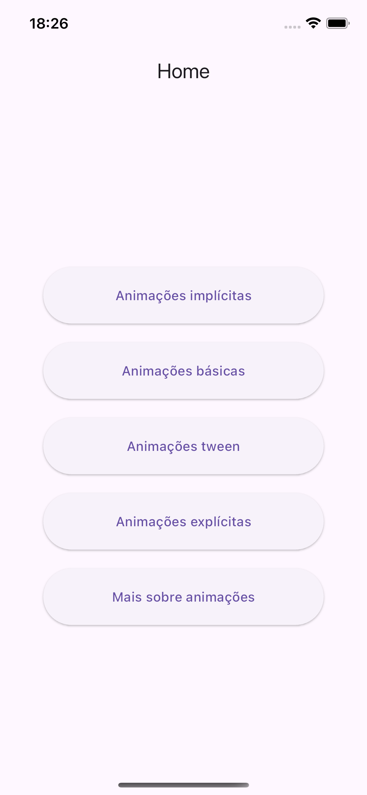
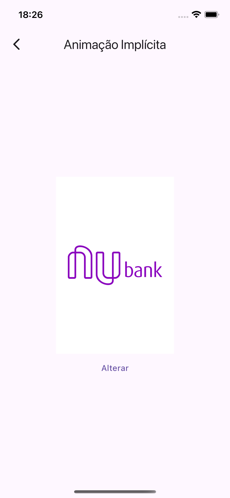
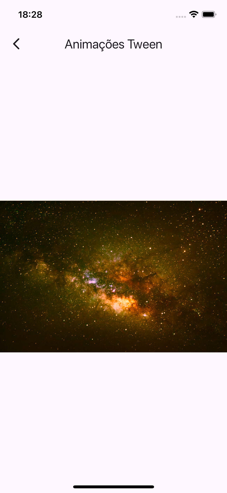

# App Animações

## Descrição

Um aplicativo simples com conceitos de animações desenvolvido durante o curso de Desenvolvimento Flutter Mobile.

## Curso

**Desenvolvimento Android e IOS com Flutter - Crie 15 Apps**

[Link para o curso na Udemy](https://www.udemy.com/course/desenvolvimento-android-e-ios-com-flutter/?couponCode=MCLARENT71824)

## Status do Projeto

- **Concluído:** 12/10/2021
- **Atualizado:** 30/07/2024

## Tecnologias Utilizadas


## Funcionalidades

- Tela inicial
- Animações implícitas
- Animações básicas
- Animações tween
- Animações explícitas
- Animações extras

## Instalação

Siga os passos abaixo para rodar o projeto localmente:

1. Clone o repositório:
    ```sh
    git clone https://github.com/rafaelleonan/app-flutter-animacoes.git
    ```
2. Navegue até o diretório do projeto:
    ```sh
    cd app-flutter-animacoes
    ```
3. Instale as dependências:
    ```sh
    flutter pub get
    ```
4. Execute o aplicativo:
    ```sh
    flutter run
    ```

## Telas
<p>
  
  
  
  
  
  
</p>

## Video Demonstração
[Assista o vídeo](https://uc76828e55e457009682e9957d36.dl.dropboxusercontent.com/cd/0/inline/CXyXj8cuCArg_eG76ByKzfSr_Gchzwad9E2_qzHqQcvNFr_9Y1k7DuO7ytfqSaD2Ce3I3nl3eO40v2W-JAm3WM0eGlaKADUml3M_VbYjxxR6ha-h3KquFB8z8AW_KB5OJCN0Mvh8UUsO53ZhdMt5TwcN/file#)
